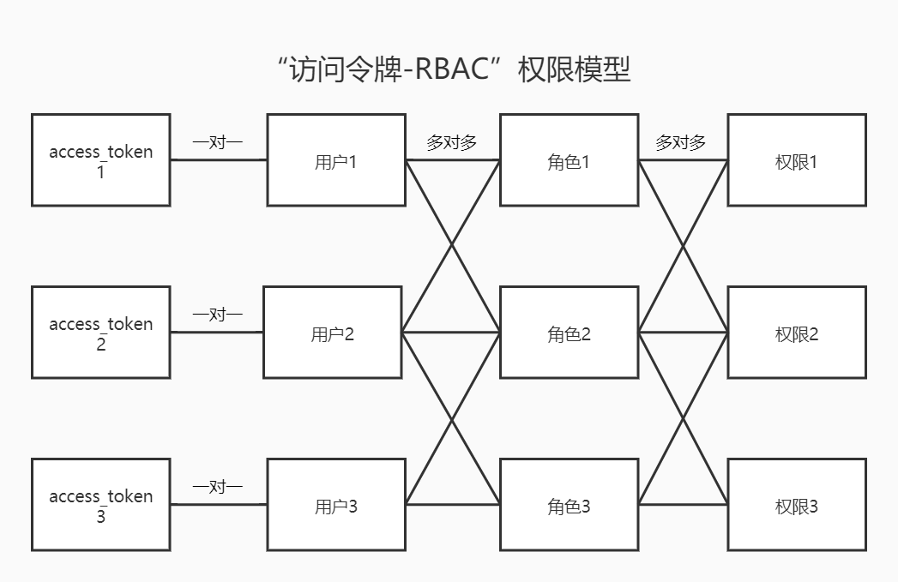
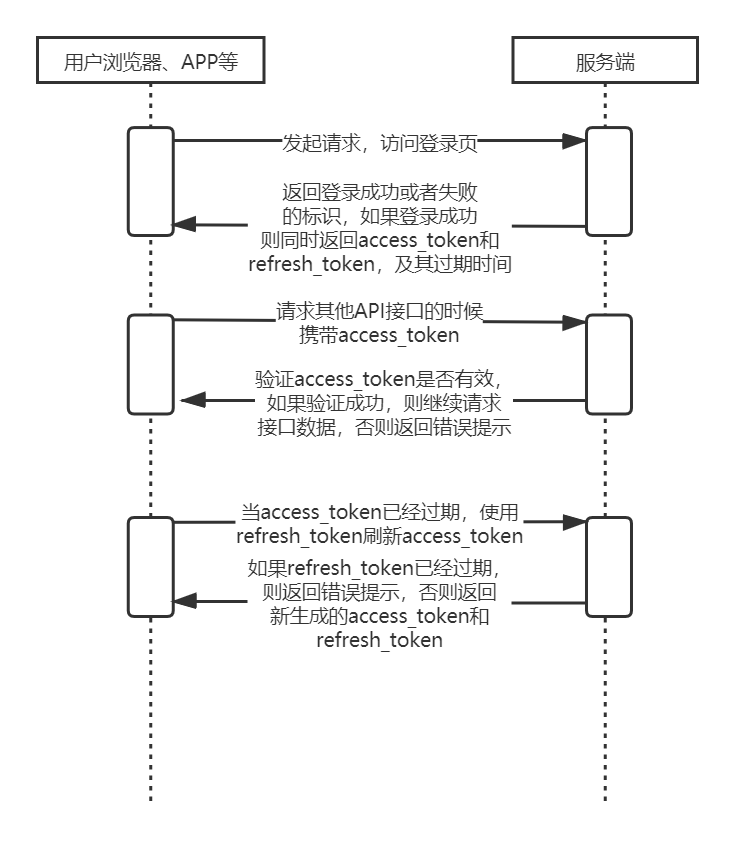

# 开发思路 #

在借鉴了`JWT`和`Apache Shiro`的实现思路后，我开发了现在正在给大家介绍的这个 [easylimit](https://github.com/zifangsky/easylimit) 框架。

在实现上，首先我扩展了**RBAC权限模型**，引入了访问令牌的概念。在**“访问令牌-RBAC”**权限模型中，针对目前主流的RBAC权限模型进行了扩展，前端页面（网页、APP、微信公众号、小程序等）不再存储用于区分服务端用户会话的session_id，而是自行选择如何存储**访问令牌**（`access_token`）和**刷新令牌**（`refresh_token`）。其中，refresh_token用于在access_token过期后请求服务端生成新的access_token，而access_token则跟服务端的用户会话（session）一一对应，即一个access_token只对应于一个服务端的唯一用户标识。因此在用户携带access_token请求服务端后，服务端就可以根据access_token查找到与之关联的session，后面就跟RBAC权限模型的鉴权步骤一样了，也就是：根据session中的用户基本信息获取用户当前拥有的角色和权限，判断当前用户是否有权限请求该资源，如果没有就返回错误提示，有则继续往下执行。

具体来讲，在前端页面访问后端服务的过程中，后端服务主要会执行以下几个核心操作：

1. 未登录用户在请求登录时，系统首先为用户会话（session）分配一个唯一标识——session_id。然后登录成功之后，自动查询当前登录用户拥有的所有角色、权限，自动创建访问令牌（access_token）以及用于刷新访问令牌的刷新令牌（refresh_token）。需要说明的是，access_token所在对象关联了存储在服务端的session_id，因此可以通过access_token查询到用户所在会话（session），refresh_token所在对象关联了access_token，因此可以通过refresh_token来刷新access_token。
2. 用户登录成功之后，携带access_token再次请求系统业务接口，系统首先通过access_token查询到关联的会话ID（session_id），然后再根据session_id查询该用户在系统中的会话（session），最后根据会话中的用户基本信息获取用户当前拥有的角色和权限，以及判断当前用户是否有权限访问请求的资源，如果没有就返回错误提示，有则继续往下执行。

与`Shiro`相比，`easylimit`这个框架的关键点在于，不再使用“将session_id存储到Cookie以便关联用户会话”的模式，而是通过给用户返回访问令牌（access_token）和刷新令牌（refresh_token），让用户灵活选择如何存储这两个令牌，只要保证调用业务接口时携带上访问令牌（access_token）即可。此外，通过将refresh_token和access_token关联，保障了可以通过refresh_token不断生成新的access_token，通过access_token和存储在服务端的session_id关联，保障了可以通过access_token找到请求用户的会话（session），以便进行后续其他鉴权操作，而这种做法也恰好避免了`JWT`不能灵活作废已颁发的令牌以及无法随时更新用户权限信息的缺陷。